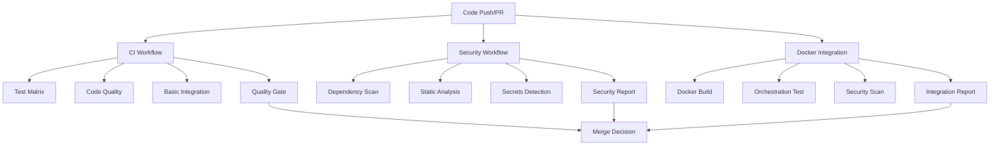
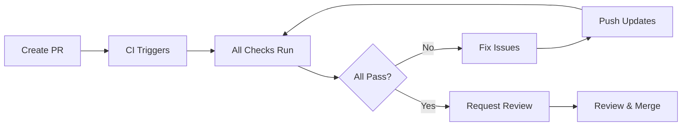

# TCF Platform CI/CD Workflows

This directory contains GitHub Actions workflows for comprehensive quality assurance, security scanning, and integration testing of the TCF Platform orchestration system.

## Overview

The TCF Platform CI/CD pipeline is designed to ensure:
- **Code Quality:** Comprehensive testing and linting
- **Security:** Multi-layered vulnerability scanning  
- **Reliability:** Docker orchestration and integration testing
- **Performance:** Fast feedback and parallel execution
- **Production Readiness:** Complete quality gates

## Workflow Architecture



## Workflow Files

### 1. ci.yml - Main CI Pipeline
**Purpose:** Core quality assurance and testing
**Triggers:** Push to master/main, Pull requests
**Duration:** ~8-12 minutes
**Parallelization:** High

#### Jobs Overview
```yaml
Jobs:
  test:           # Ruby 3.2, 3.3, 3.4 matrix testing
  lint:           # RuboCop code quality checks
  security:       # Bundler Audit + Brakeman
  docker-build:   # Docker image build verification
  integration-basic: # End-to-end API testing
  quality-gate:   # Final quality assessment
```

#### Key Features
- **Multi-version Ruby testing** (3.2, 3.3, 3.4)
- **PostgreSQL + Redis services** for realistic testing
- **Coverage reporting** with 85%+ requirement
- **Parallel execution** for fast feedback
- **Artifact collection** for debugging

#### Environment Requirements
```bash
# Required services
PostgreSQL 15+ 
Redis 7+

# Required environment variables
DATABASE_URL=postgresql://...
REDIS_URL=redis://...
JWT_SECRET=...
RACK_ENV=test
```

### 2. security.yml - Security Scanning
**Purpose:** Comprehensive security vulnerability detection
**Triggers:** Push, PR, Daily schedule (2 AM UTC), Manual
**Duration:** ~15-20 minutes
**Parallelization:** Medium

#### Jobs Overview
```yaml
Jobs:
  dependency-scan:    # Bundler Audit + custom dependency checks
  static-analysis:    # Brakeman + RuboCop Security + custom patterns
  secrets-scan:       # Gitleaks + custom secret detection
  security-report:    # Comprehensive reporting + PR comments
```

#### Security Layers
1. **Dependency Vulnerabilities**
   - Bundler Audit (official CVE database)
   - Custom vulnerability patterns
   - License compliance checking

2. **Static Code Analysis**
   - Brakeman security scanner
   - RuboCop Security cops
   - Custom security pattern detection

3. **Secrets Detection**
   - Gitleaks for committed secrets
   - Custom patterns for TCF-specific secrets
   - Environment variable exposure checks

4. **Docker Security**
   - Trivy vulnerability scanning
   - Dockerfile security analysis
   - Container configuration checks

#### Reporting Features
- **PR Comments** with security summaries
- **Artifact Collection** for detailed analysis
- **Security Scoring** with actionable recommendations
- **Critical Issue Blocking** prevents merging unsafe code

### 3. docker-integration.yml - Container Orchestration
**Purpose:** Docker build, orchestration, and integration testing
**Triggers:** Changes to Docker files, compose configs, or core code
**Duration:** ~20-30 minutes
**Parallelization:** Medium

#### Jobs Overview
```yaml
Jobs:
  docker-build-test:        # Multi-dockerfile building
  docker-orchestration-test: # Docker Compose integration
  docker-security-scan:     # Container vulnerability scanning
  integration-report:       # Comprehensive reporting
```

#### Unique TCF Platform Features
- **Multi-service Orchestration** testing with docker-compose
- **Service Connectivity** verification between containers
- **CLI Functionality** testing within containers
- **Resource Usage** monitoring and analysis
- **Restart Resilience** testing for production scenarios

#### Test Scenarios
```yaml
Test Coverage:
  - Docker image builds (production + development)
  - Container startup and health checks
  - Service-to-service communication
  - Database connectivity (PostgreSQL)
  - Cache connectivity (Redis)
  - API endpoint functionality
  - CLI command execution
  - Service restart scenarios
  - Resource consumption analysis
```

## Quality Gates

### Merge Requirements
All workflows must pass for code to be merged:

#### Critical Blocking Checks
- ✅ **All Ruby versions pass tests**
- ✅ **Code coverage ≥ 85%**
- ✅ **Zero RuboCop violations**
- ✅ **No critical security vulnerabilities**
- ✅ **Docker images build successfully**
- ✅ **Docker orchestration works**

#### Warning-Only Checks
- ⚠️ **Medium/Low security findings** (reviewed but not blocking)
- ⚠️ **Performance degradation** (monitored)
- ⚠️ **Documentation gaps** (tracked)

### Quality Scoring
Each workflow contributes to an overall quality score:

```ruby
# Scoring algorithm (simplified)
def calculate_quality_score
  {
    test_coverage: coverage_percentage,
    code_quality: rubocop_score,
    security: security_score,
    docker_health: container_score,
    overall: weighted_average
  }
end
```

## Performance Optimization

### Parallel Execution Strategy
```yaml
Strategy:
  ci.yml:
    - Test matrix runs in parallel (3 Ruby versions)
    - Independent jobs (lint, security, docker) run simultaneously
    
  security.yml:
    - Multiple scan types run in parallel
    - Artifact collection happens concurrently
    
  docker-integration.yml:
    - Build testing runs independently
    - Orchestration uses sequential dependency chain for reliability
```

### Caching Strategy
```yaml
Caching:
  Ruby Dependencies:
    - Bundler cache with ruby/setup-ruby@v1
    - Matrix-specific caches for different Ruby versions
    
  Docker Layers:
    - Docker Buildx caching
    - Multi-stage build optimization
    
  Security Databases:
    - Advisory database caching
    - Scanner tool caching
```

### Resource Management
- **Timeout Controls:** All jobs have appropriate timeouts
- **Concurrency Limits:** Prevent resource exhaustion
- **Artifact Retention:** Automatic cleanup of old artifacts
- **Log Management:** Structured logging with retention policies

## Development Workflow Integration

### TDD Support
The workflows are designed to support Test-Driven Development:

```bash
# Local development cycle
1. Write failing test
2. Push to feature branch
3. CI runs automatically
4. Fix issues locally
5. Push updates
6. Repeat until all checks pass
```

### PR Workflow


### Branch Protection Integration
These workflows integrate with GitHub branch protection:

```yaml
# .github/branch-protection-rules.md
Required Status Checks:
  - CI / Quality Gate
  - Security Scanning / Security Report Generation  
  - Docker Integration Testing / Docker Integration Report
```

## Monitoring and Observability

### Workflow Metrics
- **Success Rate:** Track workflow pass/fail rates
- **Duration Trends:** Monitor performance over time
- **Failure Analysis:** Categorize and track failure types
- **Resource Usage:** Monitor compute and storage costs

### Alerting
```yaml
Alerts:
  Critical:
    - Workflow failures on master branch
    - Security vulnerabilities in dependencies
    - Docker orchestration failures
    
  Warning:
    - Long-running workflows (>30 minutes)
    - Test coverage drops
    - Increasing failure rates
```

### Dashboards
Available dashboards (when implemented):
- **Quality Overview:** Overall health metrics
- **Security Status:** Vulnerability trends
- **Performance Trends:** Build time analysis
- **Team Productivity:** PR and review metrics

## Troubleshooting

### Common Issues

#### Test Failures
```bash
# Debugging test failures
gh run list --workflow=ci.yml
gh run view <run-id>
gh run download <run-id>  # Download artifacts for analysis
```

#### Security Scan Issues
```bash
# Review security findings
gh run view <security-run-id>
# Download security artifacts
gh run download <run-id> --name security-summary-report
```

#### Docker Integration Problems
```bash
# Debug orchestration issues
gh run view <docker-run-id>
# Check specific logs
gh run download <run-id> --name docker-orchestration-logs
```

### Performance Issues

#### Slow CI Runs
1. **Check Resource Usage:** Monitor job duration trends
2. **Review Test Performance:** Identify slow test files
3. **Optimize Dependencies:** Update caching strategies
4. **Parallelize Further:** Split long-running jobs

#### Failed Orchestration Tests
1. **Check Service Health:** Verify all containers start properly
2. **Network Issues:** Ensure service-to-service connectivity
3. **Resource Constraints:** Monitor memory and CPU usage
4. **Timing Issues:** Add appropriate waits for service readiness

## Customization

### Environment-Specific Configuration
Workflows can be customized for different environments:

```yaml
# Example environment matrix
strategy:
  matrix:
    environment: [development, staging, production]
    ruby-version: [3.2, 3.3, 3.4]
```

### Adding New Checks
To add new quality checks:

1. **Create Job:** Add new job to appropriate workflow
2. **Update Dependencies:** Add any required services
3. **Configure Artifacts:** Ensure results are collected
4. **Update Branch Protection:** Add to required checks
5. **Document Changes:** Update this README

### Workflow Extensions
Common extensions:
- **Performance Testing:** Add load testing jobs
- **Database Migrations:** Test schema changes
- **API Contract Testing:** Validate service interfaces
- **End-to-End Testing:** Full user journey testing

## Best Practices

### Workflow Design
- ✅ **Fast Feedback:** Fail fast on obvious issues
- ✅ **Parallel Execution:** Maximize concurrency
- ✅ **Artifact Collection:** Save debugging information
- ✅ **Clear Messaging:** Descriptive job and step names
- ✅ **Timeout Protection:** Prevent hanging jobs

### Security Practices
- ✅ **Secret Management:** Use GitHub Secrets for sensitive data
- ✅ **Least Privilege:** Minimal required permissions
- ✅ **Audit Trails:** Log all security-relevant actions
- ✅ **Regular Updates:** Keep scanners and tools current

### Maintenance
- ✅ **Regular Reviews:** Monthly workflow performance review
- ✅ **Version Updates:** Keep actions and tools updated
- ✅ **Documentation Sync:** Keep README current with changes
- ✅ **Performance Monitoring:** Track and optimize run times

## Support and Contribution

### Getting Help
- **Workflow Issues:** Create issue with `ci/cd` label
- **Security Questions:** Tag `@tcf-platform/security-team`
- **Docker Problems:** Tag `@tcf-platform/devops-team`
- **General Questions:** Tag `@tcf-platform/core-team`

### Contributing
To improve the CI/CD workflows:

1. **Fork Repository:** Create your own fork
2. **Test Changes:** Verify workflows work in your fork
3. **Create PR:** Submit with detailed description
4. **Request Review:** Tag appropriate team members
5. **Monitor Results:** Ensure no regressions

### Workflow Versioning
- **Major Changes:** Update workflow version comments
- **Breaking Changes:** Coordinate with team first
- **Rollback Plan:** Always test changes in fork first

---

*This documentation is maintained by the TCF Platform team. For updates or corrections, please submit a pull request.*